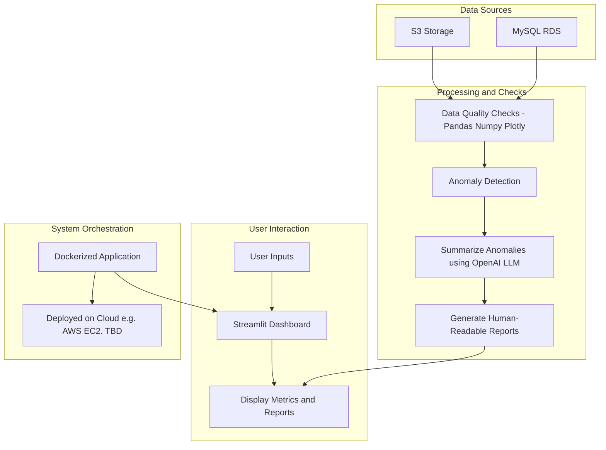

# LLM-Powered Data Quality Monitor


## Problem It Solves

Data quality issues lead to:

- **Broken dashboards** with incorrect visualizations
- **Revenue loss** from bad business decisions
- **Compliance violations** and regulatory issues
- **Lost trust** in data-driven insights

This tool automatically detects data anomalies and provides AI-powered explanations to help data teams quickly identify and resolve quality issues.

## Architecture



## Technology Stack

- **Data Sources**: AWS S3, MySQL RDS
- **Processing**: Python, Pandas, NumPy
- **Visualization**: Plotly, Streamlit
- **AI**: OpenAI GPT-4
- **Deployment**: Docker
- **Testing**: Pytest, Selenium, Streamlit-testing

## Pipeline Steps

1. **Data Ingestion**
   - Connect to AWS S3 buckets
   - Query MySQL RDS tables
   - Load data into Pandas DataFrames

2. **Quality Analysis**
   - Detect missing values
   - Identify duplicate records
   - Find statistical outliers (IQR method)
   - Calculate skewness metrics
   - Check for zero-variance columns

3. **AI Summarization**
   - Send anomaly data to OpenAI
   - Generate human-readable explanations
   - Provide actionable recommendations

4. **Interactive Dashboard**
   - Display metrics and charts
   - Show anomaly visualizations
   - Present AI-generated insights

## How to Run

### Prerequisites

- Docker installed
- AWS credentials configured
- OpenAI API key

### Environment Setup

Create `.env` file:

```bash
AWS_ACCESS_KEY_ID=your_access_key
AWS_SECRET_ACCESS_KEY=your_secret_key
AWS_DEFAULT_REGION=us-east-1
AWS_SECRET=your_secrets_manager_secret
MYSQL_HOST=your_rds_endpoint
MYSQL_DB_NAME=your_database
OPENAI_API_KEY=your_openai_key
```

### Run Locally

```bash
# Install dependencies
pip install -e .

# Start Streamlit app
streamlit run src/llm_data_quality_monitor/dashboard/streamlit_app.py
```

## How to Test

### Unit Tests

```bash
# Run all tests
pytest tests/ -v

# Run specific test files
pytest tests/test_utils.py -v
pytest tests/test_anomaly_detector.py -v
```

### UI Tests

```bash
# Install UI testing dependencies
pip install streamlit-testing selenium

# Run Streamlit component tests
pytest tests/test_streamlit_ui.py -v

# Run Selenium integration tests (requires Chrome)
pytest tests/test_selenium_integration.py -v

# Run all UI tests
python run_ui_tests.py
```

### Test Requirements

- Chrome/Chromium browser (for Selenium tests)
- ChromeDriver in PATH
- Valid AWS credentials (for integration tests)

## Usage

1. **Select Data Source**: Choose between MySQL or S3
2. **Enter Connection Details**: 
   - MySQL: Table name
   - S3: Bucket name and object key
3. **Run Quality Check**: Click the button to analyze data
4. **Review Results**:
   - View interactive charts
   - Read AI-generated summary
   - Examine raw anomaly data
   - Browse sample data

## Features

- ✅ **Multi-source data ingestion** (S3, MySQL)
- ✅ **Comprehensive anomaly detection**
- ✅ **AI-powered explanations**
- ✅ **Interactive visualizations**
- ✅ **Containerized deployment**
- ✅ **Comprehensive test suite**
- ✅ **Real-time processing**
