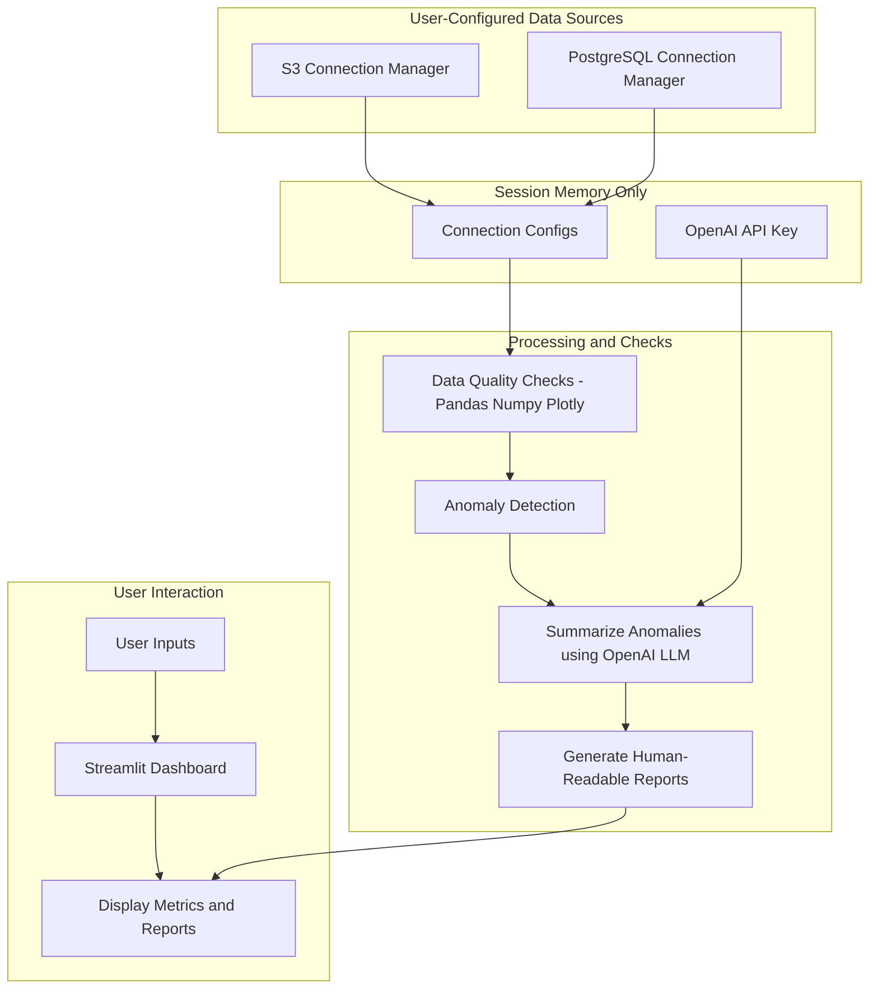

# LLM-Powered Data Quality Monitor


## Problem It Solves

Data quality issues lead to:

- **Broken dashboards** with incorrect visualizations
- **Revenue loss** from bad business decisions
- **Compliance violations** and regulatory issues
- **Lost trust** in data-driven insights

This tool automatically detects data anomalies and provides AI-powered explanations to help data teams quickly identify and resolve quality issues.

## Architecture


```mermaid
graph TD
    %% User Interaction
    subgraph A[User Interaction]
        direction TB
        A1[User Inputs] --> A2[Streamlit Dashboard]
        A2 --> A3[Display Metrics and Reports]
    end

    %% Data Sources
    subgraph B[User-Configured Data Sources]
        direction TB
        B1[S3 Connection Manager]
        B2[PostgreSQL Connection Manager]
    end

    %% Session State
    subgraph D[Session Memory Only]
        direction TB
        D1[Connection Configs]
        D2[OpenAI API Key]
    end

    %% Data Processing and Checks
    subgraph C[Processing and Checks]
        direction TB
        C1[Data Quality Checks - Pandas Numpy Plotly] --> C2[Anomaly Detection]
        C2 --> C3[Summarize Anomalies using OpenAI LLM]
        C3 --> C4[Generate Human-Readable Reports]
    end

    %% Connections
    B1 --> D1
    B2 --> D1
    D1 --> C1
    D2 --> C3
    C4 --> A3
```

## Technology Stack

- **Data Sources**: AWS S3, PostgreSQL
- **Processing**: Python, Pandas, NumPy
- **Visualization**: Plotly, Streamlit
- **AI**: OpenAI GPT-4o-mini (user-supplied key)
- **Security**: Session-only credential storage — nothing written to disk
- **Testing**: Pytest, Selenium, Streamlit-testing

## Pipeline Steps

1. **Connection Management**
   - Add named PostgreSQL or S3 connections within the session
   - All credentials held in session memory only — never written to disk
   - Test connections before use
   - Switch between multiple named connections within the same session

2. **Data Ingestion**
   - Browse and select tables from a connected PostgreSQL database
   - Browse and select objects from a connected S3 bucket
   - Load data into Pandas DataFrames

3. **Quality Analysis**
   - Detect missing values
   - Identify duplicate records
   - Find statistical outliers (IQR method)
   - Calculate skewness metrics
   - Check for zero-variance columns

4. **AI Summarization**
   - User provides their own OpenAI API key via the sidebar (held in session memory only, never stored)
   - Send anomaly data to OpenAI
   - Generate human-readable explanations
   - Provide actionable recommendations

5. **Interactive Dashboard**
   - Display metrics and charts
   - Show anomaly visualizations
   - Present AI-generated insights

## How to Run

### Prerequisites

- Python >= 3.11
- An OpenAI API key ([get one here](https://platform.openai.com/api-keys))
- Access to a PostgreSQL database and/or AWS S3 bucket

### Run Locally

```bash
# Install the package and all dependencies
pip install -e .

# Start the Streamlit app
streamlit run src/llm_data_quality_monitor/dashboard/streamlit_app.py
```

No `.env` file or `secrets.toml` configuration is required. All credentials and connection details are entered through the app UI and held in session memory only.

### Streamlit Cloud Deployment

No secrets need to be pre-configured in the Streamlit Cloud secrets UI. Users supply their own OpenAI API key and connection credentials directly in the app — nothing is stored server-side.

## How to Test

```bash
# Run all unit tests
pytest tests/ -v

# Run specific test files
pytest tests/test_utils.py -v
pytest tests/test_anomaly_detector.py -v
pytest tests/test_streamlit_app.py -v

# Run Streamlit UI component tests
pytest tests/test_streamlit_ui.py -v

# Run Selenium integration tests (requires Chrome and ChromeDriver in PATH)
pytest tests/test_selenium_integration.py -v
```

## Usage

1. **Enter your OpenAI API key** in the sidebar — held in session memory only, never written to disk
2. **Select a data source**: PostgreSQL or S3
3. **Add a connection** using the expander form:
   - PostgreSQL: host, port, database, username, password, SSL mode
   - S3: Access Key ID, Secret Access Key, region, optional session token
4. **Test the connection** before saving
5. **Save the connection** under a name to reuse within the session
6. **Select a saved connection** from the dropdown
7. **Browse and select** a table (PostgreSQL) or object (S3)
8. **Run Data Quality Check** to analyze the data
9. **Review results**:
   - Interactive anomaly charts
   - AI-generated summary
   - Raw anomaly data
   - Sample data preview

## Credential Security

- All credentials (PostgreSQL passwords, AWS keys, session tokens, OpenAI API key) are held exclusively in Streamlit session state for the duration of the browser session
- Nothing is written to disk — closing the browser tab discards everything
- Each user's credentials are isolated to their own session
- No server-side storage, no encryption keys to manage, no credential files to protect

## Features

- ✅ **User-configurable connections** (PostgreSQL, S3) — no hardcoded credentials
- ✅ **Session-only credential storage** — nothing written to disk
- ✅ **Connection testing** before use
- ✅ **Multi-connection management** — save and switch between named connections within a session
- ✅ **Table and object browsing** from connected sources
- ✅ **Per-user OpenAI API key** — each user supplies their own
- ✅ **Comprehensive anomaly detection**
- ✅ **AI-powered explanations**
- ✅ **Interactive visualizations**
- ✅ **Comprehensive test suite**
